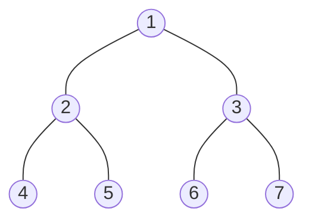

# 深さ優先探索 (**D**epth-**F**irst **S**earch)

DFS, バックトラック法、縦型探索、とも。（[ref](https://ja.wikipedia.org/wiki/%E6%B7%B1%E3%81%95%E5%84%AA%E5%85%88%E6%8E%A2%E7%B4%A2)）

## 概要

木やグラフを探索するためのアルゴリズム。
最初のノードから、子のないノードに行きつくまで深く伸ばすような探索方法。
子のないノードに行きついた後は、子の探索が全て完了していないようなノードまで戻り、再び深く伸ばす探索を行う。

## 順序付け

下の図の木を例として

1 から始めて DFS で探索を行う場合、アクセス順序は `1, 2, 4, 5, 3, 6, 7` となる。

- 行きがけ順
  - ノードへのアクセス順のこと。
    - 上記の木の例では `1, 2, 4, 5, 3, 6, 7` となる。
- 帰りがけ順
  - ノードに対し探索先がなくなった順のこと。
    - 上記の木の例では `4, 5, 2, 6, 7, 3, 1` となる。
